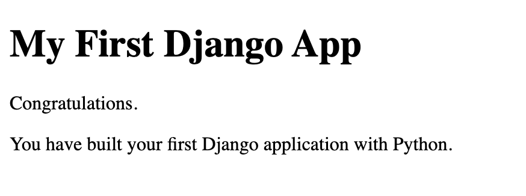

# Create a Very Basic Django App with Python

In this repository, you will have a template to the absolute basic app that you can create with Django and Python.



## About the Author

@author: Jean-Christophe Chouinard

@title: Sr. SEO Specialist at SEEK

Blog: [jcchouinard.com](https://www.jcchouinard.com)

Linkedin:[/in/jeanchristophechouinard](https://www.linkedin.com/in/jeanchristophechouinard)

Twitter:[@ChouinardJC](https://twitter.com/ChouinardJC)

## Getting Started

## Clone Github Repository

`$ git clone https://github.com/jcchouinard/Django-tutorial.git`

## Install Packages
`$ pip install -r requirements.txt`
or 
`$ conda install --file requirements.txt`

## Create the Django Project

`$ django-admin startproject <PROJECT_NAME>`
`$ django-admin startproject first_django_app`

## Move into the Project

`$ cd <PROJECT_NAME>`
`$ cd first_django_app`

## Create a Django App in your project
`$ python manage.py startapp <APP_NAME>`
`$ python manage.py startapp django_app`

## Add the App to settings.py

In your app settings.py file.
first_django_app > dirst_django_app > settings.py

Go to the INSTALLED_APPS, and add your <APP_NAME> app to the list. 
```
INSTALLED_APPS = [
    'django_app',
    'django.contrib.admin',
    'django.contrib.auth',
    'django.contrib.contenttypes',
    'django.contrib.sessions',
    'django.contrib.messages',
    'django.contrib.staticfiles',
]
```

## Add the URL of your App to urls.py

In the `urls.py` file:
first_django_app > first_django_app > urls.py

Import the `include` module.
`from django.urls import include, path`

Add the `path('', include('<APP_NAME>.urls'))` to the list of url patterns.

```
from django.contrib import admin
from django.urls import include, path

urlpatterns = [
    path('admin/', admin.site.urls),
    path('', include('django_app.urls'))
]
```
Save the file.

## Move to the APP directory

`$ cd <APP_NAME>`
`$ cd django_app`

## Create the APP urls.py file

`$ touch urls.py`

## Modify the urls.py file

Open the urls.py file
first_django_app > django_app > urls.py

`$ code urls.py`

Add this to the urls.py file.
```
from django.urls import path

from . import views

urlpatterns = [
    path('', views.index, name='index')
]
```

Save the file.

## Modify the Views.py file
Open the views.py file
first_django_app > django_app > views.py

We need to create the index route inside the views.py file.

The route will use the render module to render the `index.html` page template.
```
def index(request):
    return render(request, "<APP_NAME>/index.html")
```

Here is the code to have in the views.py file.

```
from django.http import HttpResponse
from django.shortcuts import render

# Create your views here.
def index(request):
    return render(request, 'django_app/index.html')
```

## Create the Template Directory

`$ mkdir -p templates/<APP_NAME>`
`$ mkdir -p templates/django_app`

## Create the index.html file

Inside the directory create the `index.html` file.

first_django_app > django_app > templates > django_app > index.html

`$ touch templates/django_app/index.html`

## Create Your Index.html template
Open the `index.html` file.
first_django_app > django_app > templates > django_app > index.html

`$ code templates/django_app/index.html`

```
<!DOCTYPE html>
<html>
    <head lang="en">
        <meta charset="utf-8">
        <meta http-equiv="X-UA-Compatible" content="IE=edge">
        <title>My First Django App</title>
        <meta name="viewport" content="width=device-width, initial-scale=1">
    </head>
    <body>
        <h1>My First Django App</h1>
        <p>Congratulations.</p>
        <p>You have built your first Django application with Python.</p>
    </body>
</html>
```

## Come back to project directory

`$ cd ..`

## Make migrations

`$ python manage.py makemigrations`
`$ python manage.py migrate`

## Run Django Server

`$ python manage.py runserver`

## Open the IP adress in Your Browser

Open the given URL in your browser.
`http://127.0.0.1:8000/`

## Deactivate the environment
`$ conda deactivate`


## Other Interesting Guides from The Author

[Python for SEO: Complete Guide (in 5 Chapters)](https://www.jcchouinard.com/python-for-seo/)

- [Install Python With Anaconda (On Windows)](https://www.jcchouinard.com/install-python-with-anaconda-on-windows/)
- [Python Libraries for Beginners](https://www.jcchouinard.com/python-libraries-for-seo/)

[Learn Git and Github (Complete Guide)](https://www.jcchouinard.com/learn-git-and-github/)

- [Clone Github Repository on Windows](https://www.jcchouinard.com/clone-github-repository-on-windows/)
- [Add a File to Github Using Git Bash](https://www.jcchouinard.com/add-a-file-to-github-with-git-bash/)

Automation

- [Python Script Automation Using Task Scheduler (Windows)](https://www.jcchouinard.com/python-automation-using-task-scheduler/)
- [Python Script Automation Using CRON (Mac)](https://www.jcchouinard.com/python-automation-with-cron-on-mac/)

WebScraping

- [Web Scraping With Python and Requests-HTML](https://www.jcchouinard.com/web-scraping-with-python-and-requests-html/)
- [How to use Selenium](https://www.jcchouinard.com/learn-selenium-python-seo-automation/)

APIs

- [Google Search Console API: Complete Guide (in 4 Chapters)](https://www.jcchouinard.com/google-search-console-api/)
- [Intro to GSC API with Python (Video)](https://www.jcchouinard.com/intro-to-gsc-api-with-python/)
- [Google Analytics Reporting API v4 using Python [2020 update]](https://www.jcchouinard.com/google-analytics-api-using-python/)
- [How to use Reddit API With Python](https://www.jcchouinard.com/how-to-use-reddit-api-with-python/)

Others

- [Chrome DevTools for SEO](https://www.jcchouinard.com/chrome-devtools-commands-for-seo/)
